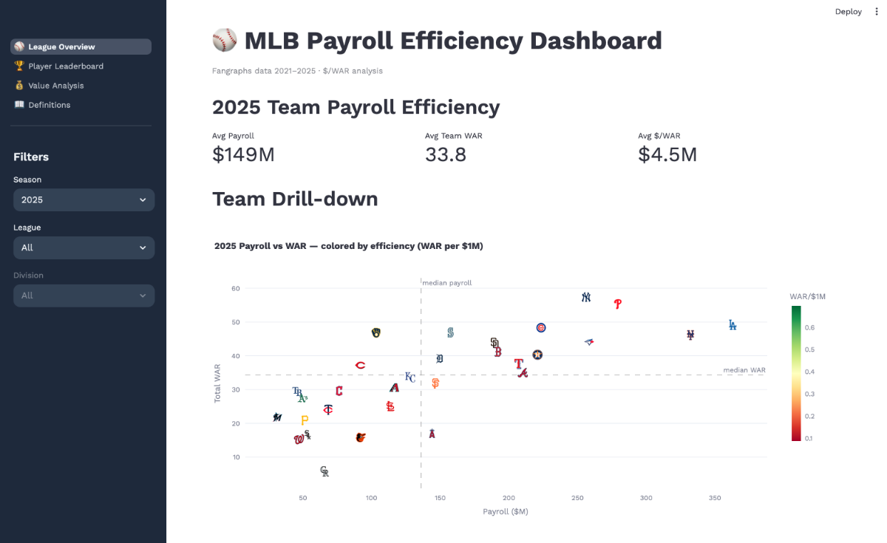
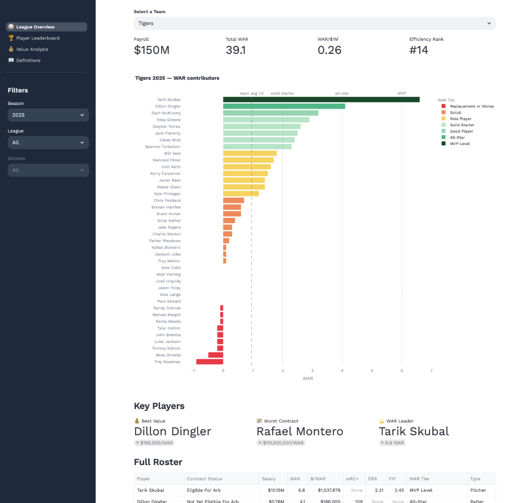
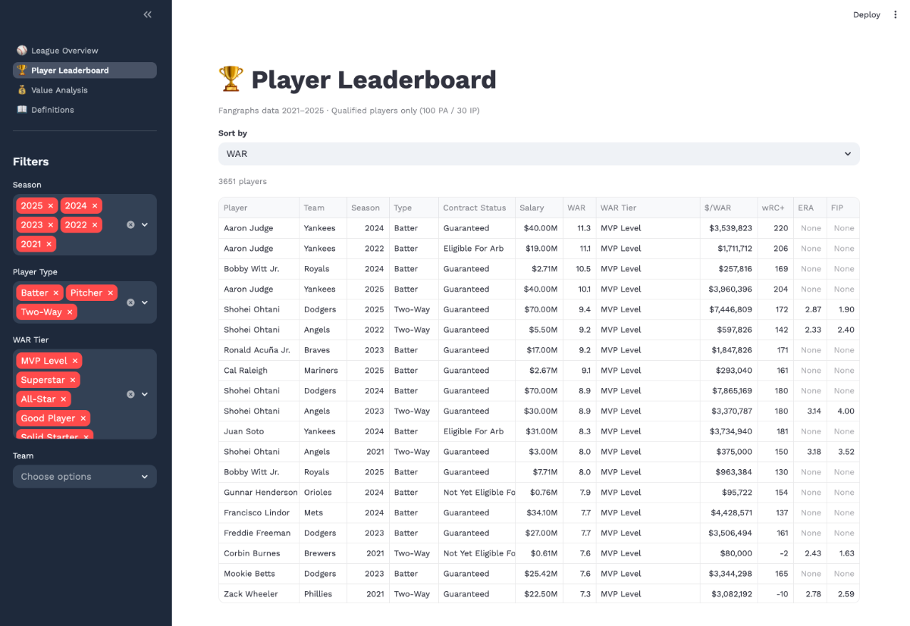
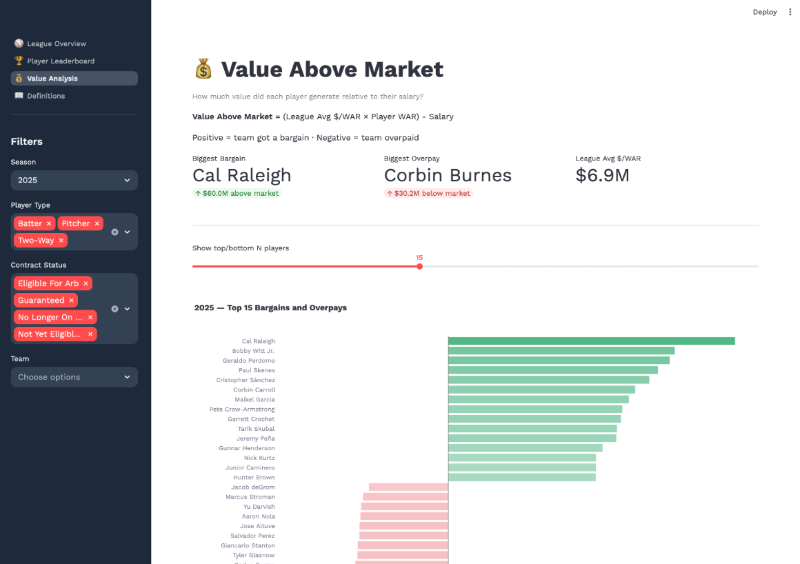

# MLB Payroll Efficiency Analysis (2021–2025)

An end-to-end data pipeline and dashboard analyzing MLB team payroll efficiency
using Wins Above Replacement (WAR) as the production metric. Built as a portfolio
project to demonstrate data engineering and analytics skills across the full stack.

> **Project status:** archival mode. Canonical parquet snapshots are the source of truth
> for analysis and demos, but they are not committed to this repository.

## Quick Navigation

- [Key Findings](#key-findings)
- [Tech Stack](#tech-stack)
- [Architecture](#architecture)
- [Data Sources](#data-sources)
- [Data Pipeline](#data-pipeline)
- [Dashboard](#dashboard)
- [How to Run](#how-to-run)
- [Project Structure](#project-structure)
- [Data Notes](#data-notes)

## What This Demonstrates

This project demonstrates production-style analytics engineering: extracting and normalizing source data with Python, loading cloud data layers (S3 + Snowflake), building tested transformations with dbt, and delivering business-facing insights in an interactive Streamlit app.

## Results at a Glance

- **Best team efficiency:** 2022 Orioles — 24.4 WAR on ~$21M payroll (**1.15 WAR per $1M**)
- **Lowest team efficiency:** 2024 White Sox — 3.3 WAR on ~$56M payroll (**~$17M per WAR**)
- **Top player bargain:** Shohei Ohtani (2021) — **~$47M value above market** on a ~$3M salary



---

## Key Findings

- **The 2022 Baltimore Orioles** were the most efficient team in the dataset — generating 24.4 WAR on a $21M payroll (1.15 WAR per $1M), the peak of their rebuild before their young core required raises.
- **The 2024 Chicago White Sox** were the least efficient — a historically bad roster producing just 3.3 WAR on a $56M payroll ($17M per WAR).
- **Shohei Ohtani 2021** generated $47M in value above market on a $3M salary — the largest single-season bargain in the dataset.
- **The Tampa Bay Rays** appear in the top 10 most efficient seasons three times (2021, 2023, 2025), validating their reputation as the gold standard for doing more with less.
- Pre-arbitration players consistently drive team efficiency — the Rays, Orioles, Guardians, and Brewers all built competitive rosters around team-controlled talent.

---

## Tech Stack

| Layer              | Technology         |
| ------------------ | ------------------ |
| Data Extraction    | Python, pybaseball |
| File Parsing       | pandas, openpyxl   |
| Storage            | AWS S3, Snowflake  |
| Transformation     | dbt (Fusion)       |
| Visualization      | Streamlit, Plotly  |
| Package Management | uv                 |

---

## Architecture


---

## Data Sources

**Payroll Data** — Fangraphs team payroll pages, manually downloaded for all 30 MLB teams across 2021–2025 seasons. Parsed from Excel exports using a custom Python pipeline.

**Batting & Pitching Stats** — Originally sourced from Fangraphs leaderboards via pybaseball. Fangraphs requests may now return HTTP 403, so normal workflows should use preserved parquet snapshots (kept outside version control) rather than relying on live refreshes. The archived dataset includes all players with at least 1 PA or 1 IP per season, covering 3,700+ batting rows and 4,300+ pitching rows.

---

## Data Pipeline

### Extraction

- `extract/parse_payroll.py` — parses Fangraphs payroll `.xlsx` files into three parquet files: `players.parquet`, `summary.parquet`, `other_payments.parquet`
- `extract/fetch_player_stats.py` — pulls batting and pitching leaderboards via pybaseball, normalizes column names, and writes to parquet

### Loading

Parquet files are uploaded to S3 and loaded into Snowflake via `COPY INTO` using a storage integration with IAM role-based authentication.

### Transformation


---

## Dashboard

A Streamlit app with three analytical views:

**🏟️ League Overview + Team Drilldown** — a single page with a top-level scatter plot of all 30 teams by payroll vs WAR (colored by efficiency), plus a lower roster drilldown section with WAR contributions, callout metrics, and a full roster table.




**🏆 Player Leaderboard** — filterable and sortable table of all qualified players across all seasons. Filter by season, player type, WAR tier, team, and contract status.



**💰 Value Analysis** — diverging bar chart showing value above/below market for each player. Identifies the biggest bargains (pre-arb stars) and biggest overpays (aging veterans on declining contracts).



---

## How to Run

### Prerequisites

- Python 3.12+
- [uv](https://github.com/astral-sh/uv) for package management
- Snowflake account
- AWS S3 bucket

### Setup

```bash
git clone https://github.com/justinpecott/mlb-payroll-efficiency
cd mlb-payroll-efficiency
uv sync
```

Create a `.env` file in the project root:

```
SNOWFLAKE_ACCOUNT=your_account
SNOWFLAKE_USER=your_user
SNOWFLAKE_PASSWORD=your_password
SNOWFLAKE_WAREHOUSE=your_warehouse
SNOWFLAKE_DATABASE=BASEBALL
SNOWFLAKE_SCHEMA=ANALYTICS
```

### Extract and Parse

```bash
# Parse payroll xlsx files
uv run python extract/parse_payroll.py --input data/payroll --output data/parquet

# Optional: fetch batting and pitching stats (may fail with Fangraphs HTTP 403)
uv run python extract/fetch_player_stats.py --output ./data/parquet --start 2021 --end 2025
```

If the fetch step fails due to upstream Fangraphs restrictions, use existing local parquet
snapshots (for example in `data/parquet/`) and continue with loading/transforms.

### dbt

```bash
dbt deps --project-dir transform/dbt
dbt seed --project-dir transform/dbt
dbt run --project-dir transform/dbt
dbt test --project-dir transform/dbt
```

### Streamlit

```bash
uv run streamlit run "apps/streamlit/1_⚾_League_Overview.py"
```

---

## Project Structure

```
mlb-payroll-efficiency/
├── apps/
│   └── streamlit/
│       ├── 1_⚾_League_Overview.py
│       ├── pages/
│       │   ├── 1_🏆_Player_Leaderboard.py
│       │   ├── 2_💰_Value_Analysis.py
│       │   └── 3_📖_Definitions.py
│       └── viz_shared.py
├── extract/
│   ├── parse_payroll.py          # xlsx → parquet
│   └── fetch_player_stats.py     # pybaseball → parquet
├── transform/
│   └── dbt/                      # dbt project
│       ├── dbt_project.yml
│       ├── packages.yml
│       ├── package-lock.yml
│       ├── models/
│       │   ├── staging/
│       │   └── marts/
│       ├── macros/
│       ├── seeds/
│       └── tests/
├── infra/
│   └── snowflake/                # S3 stage/COPY INTO SQL scripts
├── docs/
│   └── screenshots/
├── pyproject.toml
└── README.md
```

---

## Data Notes

- 2020 season excluded due to the 60-game COVID season distorting WAR accumulation
- Project is maintained in archival mode; preserved parquet snapshots are the source of truth when live Fangraphs pulls are blocked (HTTP 403)
- Players with `sa` prefix Fangraphs IDs (international players with no MLB stats) are excluded from analysis
- Traded players appear twice — once per team — with WAR and salary split by team
- Qualified analysis requires 100 PA (batters) or 30 IP (pitchers) to filter injury-shortened seasons

---

_Data sourced from [Fangraphs](https://www.fangraphs.com) via [pybaseball](https://github.com/jldbc/pybaseball)_
